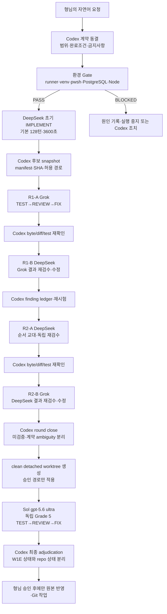

# SSWCenter AI 2라운드 상호검증 운영표준 v1.0

> 상태: 현재 권장 운영 방식
>
> 적용 대상: 구현·수정 뒤 DeepSeek↔Grok 상호검증과 별도 Sol ultra 최종검수가 필요한 중대 슬라이스
>
> 우선순위: 형님의 최신 명시 지시 → `AGENTS.md` → 이 문서 → 세부 packet·plan

## 1. 목적과 결론

이 표준은 한 AI를 영구 구현자, 다른 AI를 영구 검수자로 고정하지 않는다. 완성 후보를 기준으로 각 actor가 직접 `TEST → REVIEW → FIX`를 수행하고, Codex가 매 단계의 현재 바이트와 실행 증거를 재확인한다.

두 라운드의 목표는 “두 번 읽었다”가 아니라 다음을 증명하는 것이다.

- 상대가 만든 후보에서 재현 가능한 결함을 찾는다.
- 찾은 결함은 근거가 있을 때만 수정한다.
- 수정 뒤 같은 증거를 다시 실행한다.
- 검수자의 완료 선언보다 현재 파일·hash·exit code를 우선한다.
- 마지막에는 원본과 분리된 worktree에서 독립 Grade 5 검수를 수행한다.

단순 문법 수정이나 한 파일 smoke test에는 이 전체 절차를 강제하지 않는다. DB migration, 권한, 동시성, API 계약, 운영 복구 경계가 있는 slice에 적용한다.

## 2. 전체 흐름



여기서 `round`는 두 actor가 한 번씩 주고받는 한 묶음이고, `pass`는 한 actor의 `TEST → REVIEW → FIX` 한 번이다. 초기 구현을 기본 DeepSeek가 맡는 경우의 전체 순서는 `초기 DeepSeek → R1-A Grok → R1-B DeepSeek → R2-A DeepSeek → R2-B Grok`이다. 따라서 `R1-A → R1-B`는 같은 1라운드 안의 상호 검수이며, 별도의 3라운드가 아니다. Round 1과 Round 2의 opener를 뒤집어 순서 편향을 줄이고, 각 pass는 항상 직전 상대 결과를 기준으로 새로 시작한다. 형님이 actor를 지정하면 해당 지시가 우선한다.

## 3. 실행 전 계약 동결

Codex는 provider를 부르기 전에 아래를 기록한다.

| 항목 | 필수 내용 |
|---|---|
| Root | `/home/codexctl/workspace/sswcenter-3-0` 정확 일치 |
| Branch/status | 현재 branch와 기존 dirty WIP, 삭제 금지 대상 |
| Scope | 읽기 경로, 쓰기 허용 경로, 읽기 전용 문서 |
| Contract | API·DB·서비스·오류·권한·side-effect 완료조건 |
| Environment | Python/venv, pytest, Ruff, mypy, pwsh, PostgreSQL, Node/npm |
| Git | `MANUAL_ONLY`; stage/commit/push/reset/merge 금지 |
| Evidence | 명령, exit code, 테스트 수, hash, 미검증 범위 |

기존 dirty WIP를 정리하거나 clean main을 강제하지 않는다. 역사적 migration과 과거 packet은 현재 계약으로 추정하지 않는다.

## 4. 환경 Gate

환경 Gate는 AI 논쟁보다 먼저 통과해야 한다. provider sandbox가 런타임을 제공하지 못하면 해당 라운드는 `PASS`가 아니라 `BLOCKED` 또는 `STATIC_ONLY`로 기록한다.

```bash
git -C /home/codexctl/workspace/sswcenter-3-0 rev-parse --show-toplevel
git -C /home/codexctl/workspace/sswcenter-3-0 branch --show-current
git -C /home/codexctl/workspace/sswcenter-3-0 status --short
/home/codexctl/.local/bin/ssw-agent status
/home/codexctl/.local/bin/ssw-agent self-test
```

W0 고정 환경과 slice에 필요한 의존성을 확인한다.

- Python `3.12.3`와 `scripts/ensure-runtime.ps1`로 lock 동기화한 `backend/.venv`
- `scripts/verify-runtime.ps1`의 `SSWCENTER_RUNTIME_GREEN` preflight
- `pytest`, `ruff`, `mypy`, Alembic, SQLAlchemy, psycopg, FastAPI
- PowerShell `7.6.4`는 `/home/codexctl/.local/bin/pwsh`를 명시
- PostgreSQL `16.14` 임시 loopback cluster
- Node/npm은 `/usr/local/bin/node`, `/usr/local/bin/npm`

Python 실행 버전과 `backend/pyproject.toml`의 정적 `py311` target은 별도다. provider·Codex·검수 actor는 동일한 저장소 `backend/.venv`를 사용하고, venv가 비어 있으면 provider 라운드를 `BLOCKED`로 기록한다.

비밀값·credential 파일 내용은 읽거나 로그·prompt·보고서에 넣지 않는다.

## 5. 후보 동결과 clean worktree

### 5.1 후보 manifest

초기 구현 뒤 Codex는 현재 후보의 허용 경로만 SHA-256으로 동결한다.

```bash
sha256sum <allowed-path-1> <allowed-path-2> ... > review/evidence/<slice>-candidate.sha256
git diff --check
```

manifest에는 다음을 함께 적는다.

- 후보 생성 전후 `git status --short`
- 실제 변경 경로
- untracked 파일 목록
- provider가 읽기만 해야 하는 역사 문서
- provider 실행 전·후 hash

### 5.2 최종 worktree

최종 worktree는 clean detached HEAD를 만든 뒤 승인된 후보 경로만 적용한다. 원본 dirty tree 전체를 복사하지 않는다.

```bash
git worktree add --detach /home/codexctl/worktrees/<slice>-final-review HEAD
```

그 뒤 manifest에 있는 후보 파일과 필요한 증거 문서만 대상 worktree에 적용하고, 다음을 확인한다.

- 대상 worktree의 `git rev-parse --show-toplevel`
- 원본·대상 후보 파일 hash 일치
- `.git` 파일 유지
- 무관한 WIP·credential·venv·node_modules 미복사

Sol ultra의 수정은 이 worktree에만 남긴다. 원본 반영, stage, commit, push는 형님이 명시할 때만 수행한다.

## 6. 1·2라운드 실행 규칙

### 6.1 한 provider의 단위 작업

각 actor에게 구현/검수라는 영구 역할을 주지 않고 아래 단위를 요청한다.

1. 현재 status와 후보 hash 확인
2. 허용 범위 내 테스트 실행
3. finding을 심각도와 재현 명령과 함께 기록
4. evidence-backed 결함만 수정
5. 수정 후 동일 테스트·정적 검사 재실행
6. 변경 경로·exit code·미검증 범위 보고

`REVIEW`만 지정된 실행은 read-only다. 이번 표준의 상호 라운드는 상대 후보가 이미 완성된 상태에서 `FIX` action으로 호출하되, 내부 순서는 반드시 `TEST → REVIEW → FIX`로 고정한다.

### 6.2 라운드 순서

| 단계 | actor | 목적 |
|---|---|---|
| 초기 | DeepSeek 또는 형님 지정 actor | 후보 구현과 기본 테스트 |
| Round 1-A | Grok | 초기 후보에 대한 첫 독립 TEST→REVIEW→FIX |
| Round 1-B | DeepSeek | Grok 결과에 대한 반론·재현·수정 |
| Round 2-A | DeepSeek | opener를 교대해 다시 독립 TEST→REVIEW→FIX |
| Round 2-B | Grok | DeepSeek 결과에 대한 최종 상호 반론·수정 |
| Final | Sol `gpt-5.6-sol` `ultra` | 별도 worktree Grade 5 독립 검수·수정 |

### 6.3 turn·timeout 예산

- 기본: `max_turns=128`, `timeout=3600초`
- migration·PostgreSQL·동시성·복구·cross-layer처럼 오래 걸릴 가능성이 높은 범위는
  처음부터 `max_turns=256`, `timeout=3600초`를 배정한다.
- `256`은 DeepSeek와 Grok의 공통 hard cap이며 시작 사유, 시작·종료, 변경 유무를 ledger에 남긴다.
- Grok은 CLI의 현재 기본 모델을 사용하고 매 실행 `reasoning_effort=xhigh`를 명시한다.
- timeout·turn limit 실패는 성공이나 부분 PASS로 낮춰 쓰지 않는다.
- 독립적으로 나눌 수 있는 넓은 범위는 API/domain과 migration/PG처럼 분할할 수 있지만,
  단일 동시성 증거를 인위적으로 쪼개지는 않는다.

## 7. 반론 ledger

상호검증은 provider의 긴 서술문이 아니라 finding 단위로 adjudicate한다.

| ID | 제기 actor | 주장·심각도 | 재현 명령·exit | 상대 판정 | 수정 경로·hash | 재시험 | 상태 |
|---|---|---|---|---|---|---|---|
| F-001 | DEEPSEEK/GROK | 구체적인 결함과 영향 | 복사 가능한 명령 | ACCEPT / REJECT / DEFER + 근거 | 실제 파일·SHA | 동일 gate 결과 | OPEN/CLOSED/DEFERRED |

규칙:

- `REJECT`는 “문제 없음”이 아니라 반증 명령과 근거를 적는다.
- `DEFER`는 계약 ambiguity나 환경 blocker를 의미하며 PASS로 세지 않는다.
- 같은 finding의 수정은 한 번만 채택하고, 다음 actor는 수정 후 바이트를 재검증한다.
- provider가 “변경 없음”을 보고해도 Codex가 mtime·hash·status로 확인한다.
- 테스트를 삭제·skip·xfail하거나 assertion을 약화해 PASS를 만들지 않는다.

## 8. 필수 검증 묶음

slice 위험에 따라 전부 또는 필요한 묶음을 선택하되 선택·미선택 이유를 남긴다.

### 정적·계약

- AST/compile, trailing whitespace, conflict marker
- `git diff --check`
- API route/schema/OpenAPI generated client
- exact node/test binding과 중복 없음
- migration `down_revision` 선형성·head

### 동작·side-effect

- 생성·교체 lineage와 audit before/after/entity
- 계약·재직·자격·FAMILY 범위
- 오류 mapping: 사전검증 422, DB 동시성 409 등 현재 계약
- 상담·work card 등 금지 side-effect 없음

### PostgreSQL·운영

- `upgrade → grant → postcheck → pytest`
- 필요 시 `0026 → 0025 → 0026` downgrade/re-upgrade
- CHECK, exclusion, index, ACL, REFERENCES/TRIGGER/grant-option
- trigger bypass·replica role·권한 drift adversarial probe
- exact live node 수와 cleanup listener/process/temp/git delta = 0

### 코드 품질

- Ruff format/check
- slice-scoped mypy
- 전체 pytest/mypy는 별도 결과로 기록하며 slice 결과와 섞지 않는다.

## 9. 최종 Sol ultra 독립검수

Sol ultra는 이전 provider의 자기보고를 신뢰하지 않고 현재 worktree 바이트를 새로 읽는다.

필수 조건:

- clean detached worktree
- 원본과 별도 filesystem 경로
- 후보 manifest와 target hash 일치
- `ACTOR=CODEX`, `ACTION=FIX`, `FINAL_INDEPENDENT_REVIEW=true`
- model `gpt-5.6-sol`, reasoning `ultra`
- Grade 5 위험이면 live PostgreSQL·migration lifecycle·adversarial 검증

Sol 결과는 다음 두 상태를 분리한다.

- `W1E_STATUS=PASS|FAIL|BLOCKED`
- `REPOSITORY_WIDE_STATUS=GREEN|RED_OUT_OF_SCOPE|BLOCKED`

W1E가 녹색이어도 전체 저장소 적색, 범위 밖 mypy/pytest 실패, E2E 미실행, 계약 ambiguity가 있으면 repository-wide PASS로 표현하지 않는다.

## 10. 종료·승격 Gate

Codex는 다음을 모두 확인한 뒤 형님께 보고한다.

- 라운드별 actor/action과 설정
- 실제 변경 경로·최종 hash
- 반론 ledger의 OPEN/DEFERRED 항목
- 테스트 명령과 exit code
- runtime blocker와 범위 밖 실패
- 원본 worktree 변경 여부
- Git 작업 수행 여부

정본 승격은 자동으로 하지 않는다. 형님이 승인한 뒤에만 후보를 원본에 반영하고, 별도의 Git 지시가 있을 때만 stage/commit/push 등을 수행한다.

## 11. 보고 템플릿

### 실행 전

```text
ROOT=/home/codexctl/workspace/sswcenter-3-0
ROUND=1|2|FINAL
ACTOR=CODEX|GROK|DEEPSEEK
ACTION=IMPLEMENT|REVIEW|FIX
MODEL=<actual model or runner default>
MAX_TURNS=128|256
TIMEOUT=3600
SCOPE=<slice>
WRITE_ALLOWLIST=<paths>
GIT=MANUAL_ONLY
```

### 실행 후

```text
STATUS=PASS|FAIL|BLOCKED|STATIC_ONLY
ACTOR=<actual actor>
ACTION=<actual action>
ROUND=<round>
CHANGED_PATHS=<actual paths or NONE>
HASH=<manifest or final hash>
TEST=<command and exit>
FINDINGS=<IDs and dispositions>
REVIEW=<evidence or NONE>
UNVERIFIED=<remaining scope or NONE>
GIT=NOT_REQUESTED|REQUESTED_RESULT
```

## 12. 현재 적용 기록

이 표준은 W1E 2026-08-16 실행에서 확인된 문제를 반영했다.

- 초기 실행에서는 기본 128턴·3600초와 turn-limit 뒤 256턴 재시도를 사용했다. 이후 형님의
  최신 지시로 장시간 예상 범위는 처음부터 256턴을 배정하고 Grok은 기본 모델+xhigh로 실행한다.
- 2라운드 뒤 별도 Sol ultra worktree를 만들었다.
- 최종 runtime 환경을 복구한 뒤 PostgreSQL·Ruff·mypy·OpenAPI 증거를 확보했다.
- 최종 worktree에서 trigger bypass, ACL, exclusion, fake repository, TEMP 유입 결함을 수정했다.
- 원본 자동 반영·Git 승격은 하지 않았다.

상세 실행 원장은 [`review/handovers/W1E_20260816_PROVIDER_ROUND_LEDGER.md`](../review/handovers/W1E_20260816_PROVIDER_ROUND_LEDGER.md), 최종 결과는 [`review/reports/W1E_20260816_FINAL_REPORT.html`](../review/reports/W1E_20260816_FINAL_REPORT.html)에서 확인한다.
