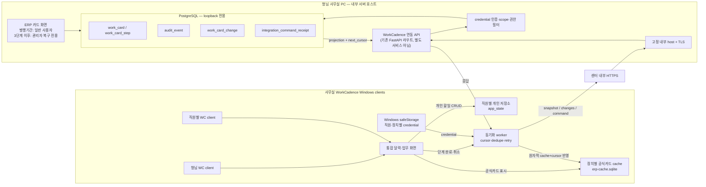
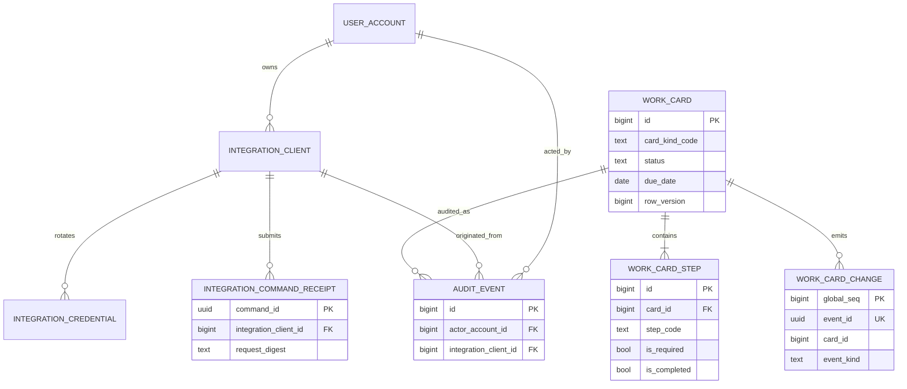
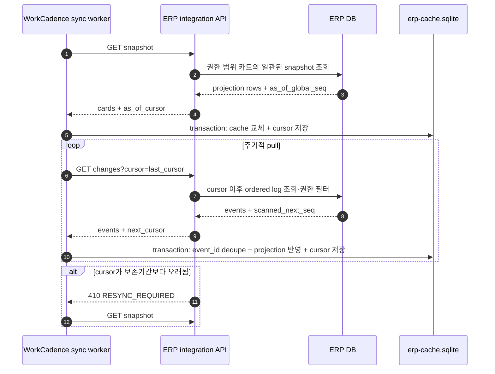
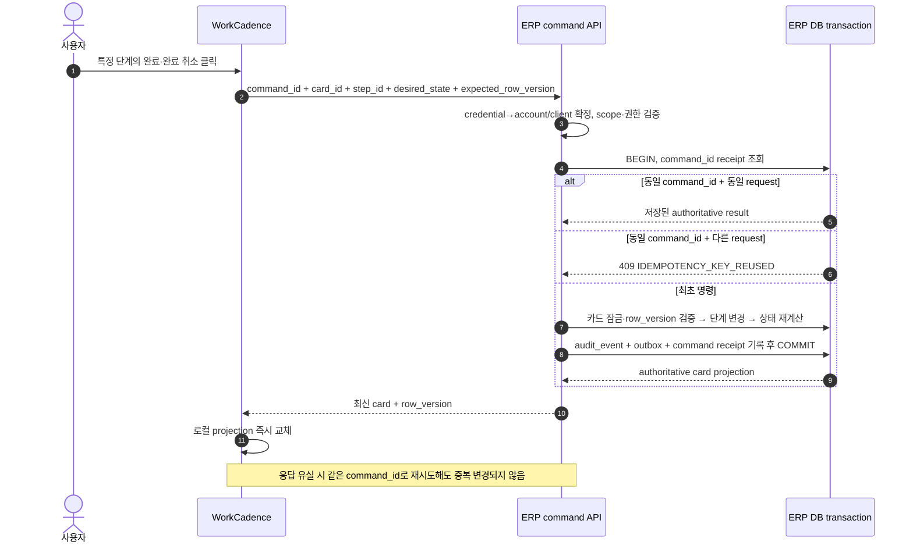

# W2 공식 업무카드 · WorkCadence 연동 계약 설계 (contract-first, DDL 이전)

> 문서 상태: `DRAFT_PROPOSED` — 아직 구현·RED·GREEN 없음. 이 문서는 설계
> 제안이며 정본 문서(01~06)를 수정하지 않는다. §10은 승인 시 정본에 반영해야
> 할 개정 목록만 제시한다.
>
> 작성일: 2026-08-10 KST
>
> 기준 branch: `main`
>
> 설계 기준 HEAD: `d4d2ab27ae05ac9a727ab794f23991b82c35730e`
>
> 참고: 이 작업본(worktree)에는 이 문서와 무관한 별도 미커밋 변경사항이
> 있다 — `docs/02`·`docs/03`의 소폭 수정과 `review/plans/
> W2_SERVICE_PLAN_NOTICE_PLAN.md`의 대폭 수정(급여계획서 슬라이스, Codex
> 독립검수 라운드 반영). 이 문서는 그 변경을 만들지도 참조하지도 않으며,
> 커밋 시에도 이 파일 하나만 staging한다.
>
> 단일 writer: 미배정 (이 문서 다음 단계에서 Task Packet으로 전환)
>
> 개정 이력: 2026-08-10 초안 작성 후 자체검토(anchor 인용 오류 2건 수정) —
> §3 3단계 전환기준·검증목적 명확화(형님) — Codex가 별도로 작성한 대안
> 설계도 반영: 채택(idempotent `command_id`/`integration_command_receipt`,
> 서버측 `next_cursor` 명시 반환·권한필터 스캔전진, 장애 시 동작 요약),
> 반려(재택 VPN 접속 — `05` §8 line 389–391의 "외부망 비노출" 원칙과
> 충돌해 형님이 "사무실 내부망 전용, VPN 신설 없음"으로 확정; ERP 카드
> 화면 영구 유지 — 형님이 "일반 사용자 대시보드/최상위 메뉴는 병행기간
> 후 제거, 관리자 전용 복구 경로만 예외"로 확정), 범위 밖 처리(카카오
> 채널 연동 — WorkCadence 쪽 별도 계획, 이 ERP 계약에는 포함하지 않음).
> 이후 Codex가 같은 결정을 반영해 별도 파일
> (`W2_WORK_CARD_WORKCADENCE_ARCHITECTURE.md`)로 다이어그램 중심 설계도를
> 작성 — 내용이 이 문서와 사실상 동일해져 정본 중복을 피하기 위해 그
> 다이어그램들을 이 문서로 병합하고 원본 파일은 삭제(형님 승인). 병합하며
> `05` §1 line 45 "PostgreSQL과 FastAPI 내부포트는 사용자 PC에 공개하지
> 않는다"·line 85 "FastAPI 모듈형 모놀리스"에 근거해 PostgreSQL
> loopback-only와 "연동 API는 별도 서비스가 아니라 기존 FastAPI 라우트"
> 두 가지를 명시적으로 추가.
>
> matrix: 신규 — Wave 1 매트릭스에는 없음. 승인되면 `SEM-W2-01`~`SEM-W2-04`
> (`review/WAVE1_CLEAN_TEST_MATRIX.md` line 124–127 — 01 공식/개인 분리,
> 02 4상태·발생이유·기한, 03 단계별 완료, 04 담당범위 제한)를 이 문서의
> 실제 계약으로 구체화한다.

## 0. 이 문서가 정하는 것과 정하지 않는 것

정한다:

- ERP와 WorkCadence 사이의 공식 업무카드 소유권 경계와 화면 이관 순서.
- ERP 쪽 `work_card`/`work_card_step` 테이블 계약 제안(컬럼·의미, 실제
  제약은 아님).
- 단계완료 트랜잭션 절차, 연동 인증 모델, 변경피드 계약.

정하지 않는다:

- 실제 Alembic revision·정확한 SQL DDL·OpenAPI operation 이름(다음
  슬라이스).
- WorkCadence 쪽 내부 구현(그쪽 저장소 소유).
- 개인 할 일(`todos`) 기능 자체의 설계(WorkCadence 단독 소유, 이 계약의
  범위 밖).
- 급여계획서 슬라이스(`W2_SERVICE_PLAN_NOTICE_PLAN.md`)의 내용. 이 문서는
  그 문서가 만드는 `recipient_service_plan_notice`를 카드 발생 source의
  하나로만 참조하며 그 문서의 계약을 재정의하지 않는다.

## 1. 정본 anchor

| 영역 | 참조(비수정) |
|---|---|
| 업무 의미 | `02_업무규칙_계약_v1.1.md` §9.3 공식 업무카드와 개인 할 일 (line 414–424) |
| UI 분리 | `03_UI_API_상호작용_계약_v1.2.md` §7 (line 381–393) — 대시보드 노출은 §2 메뉴별 Wave 1 화면 표 line 61·64 |
| DB 경계선언 | `04_데이터_DB_불변조건_v4.8_PostgreSQL.md` §12 Wave 2·3 경계 (line 755–786) — "실제 object 이름이나 상세 DDL 권위가 아니다"(line 757–758) |
| 공통 DB 규칙 | `04` §2.2 변경·감사 (line 79–86) — `row_version`, 무효화+대체, transaction 내 버전비교 |
| 재사용 대상 | `04` §1 (line 40–58) — `audit_event`는 Wave 0부터 있는 기존 감사 테이블, 새로 만들지 않음 |
| 인증 소유 | `05_기술_보안_파일처리_아키텍처_v1.5.md` §5 (line 213–250) — PIN/세션/CSRF만 있고 서버 간 인증 없음(신설 필요, §7) |
| durable 전달 패턴(참고) | `05` §7.1 durable worker (line 355–362) |
| 로드맵 지위 | `06_개발로드맵_결정현황_v1.2.md` §1 (line 27) Wave 2 = "일정·업무카드", §5 (line 129) Wave 2 업무의미 성숙도 `POLICY_CONFIRMED`, 다음 필수조건 "상세 DDL·API·테스트 설계" — 이 문서가 그 다음 필수조건에 해당 |
| 기존 placeholder 코드(참고, 대체 대상) | `frontend/src/pages/DashboardPage.tsx` line 55–95, 316–317 — Wave 0의 로컬 mock `WorkCard`/`localStorage` `todos`. 실제 DB·API 없음. `03` §2 표(line 64) "대시보드: Wave 0 기반 유지 \| Wave 2 업무카드 신규 구현"이 이미 이 교체를 예정해 둠 |
| 사이드바 최상위 메뉴 계약 | `03` §2 (line 59–70) — "사이드바 최상위 메뉴는 위 8개를 유지"(line 70). §3 3단계에서 `대시보드` 최상위 메뉴는 제거하되 관리자 전용 복구 경로(비-최상위-메뉴)는 남긴다 — 메뉴 개수 자체는 여전히 §10 개정 대상 |
| 네트워크 배치(참고) | `05` §8 (line 382–393) — "고정 내부 IP/호스트명", "공유기 포트포워딩·공인망 공개·클라우드 터널을 사용하지 않는다"(line 389–390). §6 네트워크 경계는 이 원칙을 그대로 따르며 개정을 요구하지 않는다 |

## 2. 소유권 원칙 (형님 확정)

1. ERP가 공식 업무카드의 **판정·원장·상태·단계·감사**를 계속 소유한다.
   WorkCadence는 표시용 projection만 가진다.
2. 개인 할 일은 처음부터 끝까지 WorkCadence만 소유한다. ERP에는 개인
   할 일 테이블·API·화면을 만들지 않는다 — `DashboardPage.tsx`의 기존
   `todos`(localStorage)도 §3 1단계에서 제거 대상이다.
3. 공식카드 상태의 dual-write는 금지한다. WorkCadence는 로컬 projection을
   가질 뿐 그 자체를 authoritative source로 쓰지 않는다.

전체 그림(§1 네트워크 경계·§4~§7의 세부 계약을 한 화면으로 요약):



- WorkCadence 쪽 상세 내부 구조(Electron main/renderer 경계 등)는 WorkCadence
  자체 설계 문서(`C:\marco\WorkCadence\docs\WORKCADENCE_ARCHITECTURE_BLUEPRINT.md`)
  소유이며 이 문서는 재정의하지 않는다.

## 3. 화면 이관 3단계 (형님 확정)

**1단계 — ERP 단독**

- ERP 독립 대시보드(`DashboardPage.tsx`)는 더 확장하지 않는다.
- 공식카드 공통 패널을 사회복지사·간호사 화면에 붙인다(월 담당 수급자
  범위, `02` §9.3 line 423–424).
- 관리자·관리책임자 화면에는 전체 범위 카드 패널을 제공한다.
- 기존 로컬 `todos`(개인 할 일)는 제거한다.

**2단계 — ERP·WorkCadence 병행**

- 같은 ERP 공식카드를 양쪽 화면에서 표시한다.
- WorkCadence는 §6 변경피드를 pull해 로컬 projection을 갱신한다.
- WorkCadence에서 단계 완료 조작 시 ERP 명령 API(§5)를 호출한다.
- ERP가 완료 상태·감사·변경 이벤트를 한 트랜잭션으로 저장한다(§5).

**3단계 — WorkCadence 단독**

- 일반 사용자용 ERP 카드 패널과 독립 대시보드(사이드바 최상위 메뉴)는
  병행기간 종료 후 제거한다(형님 확정). `03` §2 line 70 "사이드바
  최상위 메뉴는 위 8개를 유지"는 `대시보드` 항목이 빠지므로 개정 대상이다
  (§10). 이 개정이 정본에 반영되기 전까지 3단계 착수를 막는다.
- 원장·API·감사와 **관리자 전용 복구 기능**은 유지한다(형님 확정). 단
  이는 일반 사용자용 대시보드/최상위 메뉴가 아니라 관리자 권한으로만
  닿는 별도 경로다 — 최상위 메뉴 8개 수치와는 무관하게 설계한다. 정확한
  화면 형태는 다음 슬라이스에서 확정한다.
- WorkCadence가 공식 업무카드와 개인 할 일을 한 화면에서 구분해 표시한다.
- 공식카드 클릭 시 수급자·직원·계약 등 ERP 실제 처리화면으로 이동한다
  (딥링크 — 실제 경로 계약은 구현 슬라이스에서 확정).
- ERP의 공식카드 백엔드(원장·판정·감사)는 유지한다 — 3단계는 화면 이관이지
  소유권 이관이 아니다.

각 단계 전환은 형님이 별도로 승인한다. 1·2단계에서 ERP 화면을 유지하는
목적은 업무카드·다른 기능이 실제로 정상 동작하는지 점검하기 위한 **한시적
검증 용도**다. 3단계 이후에도 남는 것은 원장·API·감사와 **관리자 전용
복구 기능뿐**이며, 일반 사용자용 대시보드/최상위 메뉴는 제거한다 —
Codex 설계가 제안한 "카드 화면을 관리자·감사·복구용으로 포괄 유지"보다
좁은 범위다(형님 확정: 일반 사용자 화면은 제거, 관리자 전용 기능만 예외
로 남김). 2→3단계 전환의 승인 기준은 "WorkCadence가 §4~§6 계약 범위의
업무카드 관련 기능을 ERP와 동등하게 구현했음을 확인"이다(형님 원칙:
당분간 유지해 점검하고, 저쪽이 똑같이 구현하면 이쪽 일반 사용자 화면을
제거한다). 이 문서는 그 확인의 정확한 시점을 미리 정하지 않는다.

## 4. ERP 데이터 구조 제안 (실제 이름·DDL 아님, 다음 슬라이스에서 확정)

아래 4개 테이블의 관계 요약:



### `work_card`

| 컬럼(제안) | 의미 |
|---|---|
| 안정 ID | PK |
| `card_kind_code` | 카드 종류 판별자(갱신카드, 직원교체 상담 등) |
| `status` | `COMPLETE`/`INCOMPLETE`/`EXEMPT`/`WAITING` CHECK |
| 대상 FK | 직원·수급자 등 — 담당자 조회범위 판정에 사용(`02` §9.3 월 담당 수급자 범위) |
| `reason_code` + 표시 snapshot | 발생이유 |
| `due_date`, (선택) `visible_from_date` | 기한. `D-day`는 저장하지 않고 `due_date`와 KST 오늘로 계산 |
| origin occurrence key | 이 카드를 발생시킨 source 사실의 idempotency key(중복 생성 방지) |
| `payload_schema_version` | 아래 JSONB의 형태 버전(카드 종류별 진화 대비) |
| JSONB 부가표시 | 종류별 비핵심 표시자료만. 상태·기한·대상·권한·중복방지키는 정규 컬럼 |
| `created_at_utc`, `updated_at_utc`, `row_version` | `04` §2.2 공통 규칙 |

### 상태 전이 의미

- `WAITING`: 카드는 이미 생성되어 안정 ID를 가지지만 아직 조작 대상이
  아니다(`visible_from_date` 미도래 또는 시스템 선행조건 미충족). WAITING
  카드에 대한 단계완료 명령은 거부한다(422). `WAITING`→`INCOMPLETE` 전환은
  시스템이 조건 충족 시 자동 재판정하며 WorkCadence 명령으로 일으키지 않는다.
- `EXEMPT`: `02` §9.1 검진 면제 패턴과 같은 형태로, 사유 보존형 면제다.
  시스템 판정 또는 ERP 관리자 전용 명령으로만 설정한다 — §7 연동
  credential의 scope에 `EXEMPT` 지정 권한을 포함하지 않는다(WorkCadence는
  절대 EXEMPT를 지정할 수 없다).
- `INCOMPLETE`⇄`COMPLETE`는 양방향이다. §5의 재계산은 "완료" 명령뿐 아니라
  "해제" 명령에도 대칭 적용한다 — 이미 `COMPLETE`인 카드에서 필수 단계
  하나가 해제되면 자동으로 `INCOMPLETE`로 복귀한다(사용자가 별도로 카드
  상태를 되돌리는 명령은 없다).
- `WAITING`/`EXEMPT` 상태의 카드는 단계 자체를 조작할 수 없다(§5 명령이
  거부됨). 단계 조작은 `INCOMPLETE`/`COMPLETE` 사이에서만 유효하다.

### `work_card_step`

| 컬럼(제안) | 의미 |
|---|---|
| 안정 ID | PK |
| `card_id` | FK → `work_card` |
| `step_code` | 안정 코드(카드 종류 내에서) |
| `label_snapshot` | 표시 라벨 스냅샷 |
| `display_order`, `is_required` | 표시·완료판정용 |
| 완료상태, `completed_at_utc`, 완료 사용자 | 현재값 |
| `row_version` | 낙관적 잠금 |

**감사 이력(사람 감사 목적)**: `work_card_step`의 완료→해제→재완료 각 전이는
기존 `audit_event`(Wave 0, `04` §1 line 52)에 행위자·전후 상태·시각을
기록한다 — W1A 검진/분기상담 슬라이스가 쓰는 패턴과 동일(`04` line 55).
단, 현재 `audit_event`(`backend/app/db/models.py:857–883`)에는
`actor_account_id`(FK `user_account`)와 `actor_kind`(CHECK
`USER/SYSTEM/IMPORT/OCR/MIGRATION`)만 있고 **연동 클라이언트를 식별할
컬럼이 없다.** 이 계약은 `audit_event`에 nullable `integration_client_id`
(FK → §7 `integration_client`) 추가를 요구한다. `actor_account_id`는
요청 본문의 사용자 지정값이 아니라 **서버가 인증 컨텍스트(§7 credential에
연결된 실제 사람 세션 또는 계정)에서 확정**한다 — WorkCadence가 임의
계정을 자처할 수 없다.

**변경피드(기계 소비 목적)**: `audit_event`는 사람 감사 조회에 최적화된
범용 테이블이라 "N번 이후 전부"라는 순차 pull 질의에는 맞지 않는다.
별도 `work_card_change` 테이블을 두고 §5 트랜잭션의 마지막 단계에서
카드 변경과 **같은 트랜잭션**으로 1행을 추가한다.

### `work_card_change`

| 컬럼(제안) | 의미 |
|---|---|
| 전역 단조증가 PK(`bigint identity`) | 그 자체가 cursor 위치. 카드별 `row_version`과 달리 카드 간 전달 순서를 준다 |
| `event_id`(UUID) | 소비측 중복제거 키. PK와 분리 — PK를 외부에 그대로 노출하면 전체 이벤트 총량이 드러나므로 별도 안정 식별자를 둔다 |
| `card_id`, `card_row_version` | 대상 카드와 그 시점 버전 snapshot |
| `change_kind`(`CREATED`/`UPDATED`/`INVALIDATED`) | `INVALIDATED`는 `04` 공통 규칙의 무효화+대체(§2.2)를 반영하는 tombstone — WorkCadence는 이 값을 보면 로컬 projection에서 해당 카드를 숨긴다 |
| 최소 projection(상태·기한·발생이유·대상 식별자) | §6과 동일 최소 필드 |
| `occurred_at_utc` | 발생시각 |

- **초기 스냅샷**: cursor 없이(최초 설치) 또는 cursor가 보존기간보다
  오래되어 재생 불가능할 때, "현재 유효한 모든 카드의 최신 상태"를
  `change_kind=CREATED`로 합성해 한 번에 반환하는 snapshot 모드를 둔다 —
  전체 변경이력을 처음부터 재생하지 않는다.
- **재동기화**: `work_card_change`를 무한 보관하지 않는다면(보존기간·개수
  제한), WorkCadence의 cursor가 그 범위를 벗어난 경우 서버는 "cursor
  만료" 오류를 반환하고 클라이언트는 snapshot 모드로 다시 부트스트랩한다.
  정확한 보존기간은 다음 슬라이스에서 확정한다.
- **조회 시 권한필터와 cursor 전진의 관계**: 서버는 매 응답에 `next_cursor`
  를 명시적으로 반환한다(클라이언트가 마지막으로 받은 event로부터 추정하지
  않는다). 담당자 조회범위(§4 `work_card` 대상 FK)에 걸려 WorkCadence에
  반환하지 않는 event가 있어도, `next_cursor`는 서버가 실제로 스캔한
  위치까지 전진시킨다 — 그렇지 않으면 한 페이지의 모든 event가 권한
  밖일 때 클라이언트가 같은 위치에서 멈춰버린다.



### `integration_command_receipt`

| 컬럼(제안) | 의미 |
|---|---|
| `command_id`(UUID) | PK. 클라이언트가 생성해 요청에 싣는 idempotency key |
| `integration_client_id` | FK → §7 `integration_client` |
| `request_digest` | 요청 본문의 해시 — 같은 `command_id`로 다른 내용이 오면 거부 |
| `result_snapshot`(JSONB) | 최초 처리 결과(반환했던 카드 projection) — 재요청 시 그대로 반환 |
| `created_at_utc` | 발생시각 |

같은 `command_id`로 같은 요청이 재도착하면(응답 유실 후 재시도 등) 저장된
`result_snapshot`을 그대로 반환하고 §5 트랜잭션을 다시 실행하지 않는다.
같은 `command_id`로 **다른** `request_digest`가 오면 409
`IDEMPOTENCY_KEY_REUSED`로 거부한다. `row_version` 낙관적 잠금만으로는
이 경우를 막지 못한다 — 첫 시도가 이미 성공해 `row_version`이 증가한
뒤 재시도가 오면, 단순 `row_version` 비교로는 "이미 내가 성공시킨
요청"과 "실제로 오래된 값을 들고 온 별개 요청"을 구분할 수 없다.

## 5. 단계 완료·해제 트랜잭션 규칙 (형님 확정, 완료·해제 대칭으로 확장)

단계 완료 **또는 해제** 명령은 ERP가 한 트랜잭션에서 처리한다(두 명령은
대칭 절차를 공유한다):

0. `command_id` 조회(§4 `integration_command_receipt`) — 이미 처리된
   `command_id`면 저장된 결과를 그대로 반환하고 아래 단계를 다시
   실행하지 않는다. 같은 `command_id`에 다른 요청 본문이면 409
   `IDEMPOTENCY_KEY_REUSED`.
1. 카드 상태가 `WAITING`/`EXEMPT`면 요청을 거부한다(422, §4 상태 전이 의미).
2. 부모 카드 `row_version` 검사(낙관적 잠금 실패 시 409).
3. 단계 상태 변경(완료 또는 해제).
4. 필수 단계(`is_required`) 전체완료 여부 재계산.
5. 카드 최종 상태 결정 — WorkCadence는 카드 상태를 직접 `COMPLETE`나
   `INCOMPLETE`로 지정할 수 없다. 재계산 결과가 상태를 정한다: 필수 단계가
   모두 완료면 `COMPLETE`(`02` §9.3 line 420), 하나라도 미완료로 돌아가면
   `INCOMPLETE`로 복귀한다(이미 `COMPLETE`였던 카드도 동일하게 되돌아간다).
6. 카드 `row_version` 증가.
7. `audit_event` 기록 — `actor_account_id`는 서버가 인증 컨텍스트에서
   확정, `integration_client_id` 동시 기록(§4 감사 이력).
8. `work_card_change`에 1행 추가(같은 트랜잭션, §4).
9. `integration_command_receipt`에 이번 처리 결과를 기록(같은 트랜잭션).



## 6. WorkCadence 연동 계약

- WorkCadence의 실제 로컬 저장구조는 `tasks` 테이블이 아니라 `app_state`
  JSON 저장구조다(형님 확인). 공식카드 projection은 이 `app_state`와
  분리된 별도 저장영역에 둔다 — 개인 할 일의 자동 이월·날짜 변경·삭제
  규칙을 공식카드 projection에 적용하지 않는다.
- **공식카드는 WorkCadence에서 개인 할 일처럼 다루지 않는다**: 카드
  전체를 사용자가 직접 토글·드래그로 순서·날짜 변경·수정·삭제하는 동작을
  금지한다. WorkCadence가 공식카드에 대해 허용하는 조작은 (a) 단계
  완료/해제 명령(§5)과 (b) "ERP에서 열기"(딥링크, §3 3단계) 둘뿐이다.

  ```mermaid
  flowchart TD
      CLICK["달력 항목 클릭"] --> TYPE{"항목 종류"}
      TYPE -->|"개인 할일"| PERSONAL_ACTION["전체 완료 토글"]
      TYPE -->|"공식 업무카드"| DETAIL["카드 상세 열기"]
      DETAIL --> STEP_ACTION["단계별 완료·완료 취소"]
      DETAIL --> ERP_LINK["ERP에서 열기"]
      DETAIL --> DISABLED["제목수정·삭제·날짜드래그 금지"]
      STEP_ACTION --> ONLINE{"ERP 연결 가능?"}
      ONLINE -->|"예"| COMMAND["ERP 명령 후 결과 반영"]
      ONLINE -->|"아니오"| READ_ONLY["읽기 전용 + 마지막 동기화 시각"]
  ```
- ERP DB 직접접속은 금지, 전용 API만 사용한다.
- **PUSH(webhook) 대신 PULL**: WorkCadence가 cursor 기반 변경피드
  (`work_card_change`, §4)를 주기적으로 pull한다. WorkCadence는 직원
  Windows PC에 설치되는 데스크톱 클라이언트이며(형님 확정 — 아래 네트워크
  경계 참고) 상시 수신 가능한 공인 endpoint를 갖지 않는다. ERP가
  인바운드로 도달할 필요가 없는 pull을 유일한 계약으로 확정한다(push는
  이 문서 범위에서 재검토하지 않는다).
- **네트워크 경계(형님 확정)**: ERP 서버는 형님 사무실 PC가 호스트다
  (`05` §8 line 389 "고정 내부 IP/호스트명"의 실제 배치). WorkCadence는
  사무실 내부망에 있을 때만 이 API에 접근한다 — 재택·원격 접속(VPN 포함)
  은 이 계약 범위 밖이며 신설하지 않는다. 이는 `05` §8 line 390 "공유기
  포트포워딩·공인망 공개·클라우드 터널을 사용하지 않는다"와 그대로
  일치하므로 정본 개정 대상이 아니다(§10에 등록하지 않음). 직원은
  Windows PC의 WorkCadence 클라이언트만 사용하며, 모바일(Galaxy 등)
  클라이언트는 이 계약 범위 밖이다. WorkCadence가 사무실 밖에 있을 때는
  마지막 동기화 시점의 읽기전용 cache만 표시한다.
- **PostgreSQL은 loopback 전용**이다(`05` §1 line 45 "PostgreSQL과 FastAPI
  내부포트는 사용자 PC에 공개하지 않는다"). 같은 내부망의 다른 PC에서도
  PostgreSQL 포트에 직접 접근할 수 없고, 오직 같은 호스트의 FastAPI
  프로세스만 접속한다 — 새 결정이 아니라 기존 정본의 자연스러운 적용이다.
- **연동 API는 별도 서비스가 아니다**: 기존 ERP FastAPI(`05` §1 line 85
  "FastAPI 모듈형 모놀리스")에 추가되는 라우트 집합이다. 새 프로세스·새
  배포 단위를 만들지 않는다.
- 전달은 `at-least-once`로 보고 소비측이 `event_id`로 중복을 제거한다.
- 서버는 무상태(stateless)로 피드를 서빙한다 — cursor(=`work_card_change`
  PK 위치)는 WorkCadence가 로컬에 보관하고 매 요청에 "마지막으로 받은
  위치"를 실어 보낸다. cursor 만료·초기 스냅샷 규칙은 §4를 따른다.
- 이벤트에는 `event_id`, `schema_version`(이벤트 envelope 버전 —
  `work_card.payload_schema_version`과는 다른 값, 혼동 금지), 카드 ID, 카드
  `row_version`, 발생시각, 최소 projection(상태·기한·발생이유·대상 식별자)만
  포함한다. 카드 JSONB 부가표시 전체를 이벤트에 싣지 않는다.
- WorkCadence에서 공식카드 변경(단계 완료 등)은 온라인 상태에서만 허용하는
  것을 1차 범위로 한다. 오프라인 큐잉·재전송은 이 문서 범위 밖(필요 시
  후속 슬라이스).

**장애 시 동작(요약)**:

- ERP 접근 불가(사무실 밖, 서버 다운 등): 공식카드는 마지막 동기화
  시각과 함께 읽기전용으로 표시한다. 개인 할 일은 영향 없다.
- 명령 응답 유실: WorkCadence는 같은 `command_id`로 재시도한다(§4
  `integration_command_receipt`가 중복 실행을 막는다).
- `row_version` 충돌(409): 자동 재시도하지 않고 최신 projection을 보여준
  뒤 사용자가 다시 판단하게 한다.
- credential 폐기·만료: WorkCadence는 로컬 공식카드 projection
  (`erp-cache.sqlite`, §8)을 삭제하고 재등록 전까지 동기화를 중단한다.
- `erp-cache.sqlite` 손상: 파일을 삭제하고 §4 초기 스냅샷으로 다시
  부트스트랩한다. 개인 할 일(`app_state`)과 분리돼 있으므로 원장·개인
  데이터 모두 영향 없다.

## 7. 인증·감사 계약

- 사람용 PIN·세션·CSRF(`05` §5.1–5.2)와 연동 인증을 분리한다. 기존
  `user_account`에 서비스 계정을 억지로 얹지 않는다.
- 신규 `integration_client`(설치 단위 식별) + `integration_credential`
  (opaque Bearer, HTTPS 전용)을 둔다.
- 서버는 credential의 **복구 불가능한 digest만** 저장한다(예: SHA-256).
  PIN의 Argon2id는 저엔트로피 6자리 숫자를 브루트포스로부터 지연시키기
  위한 KDF로, 이미 고엔트로피인 opaque Bearer 토큰에는 목적이 다르다 —
  같은 방식을 그대로 가져오지 않는다. 원문은 어느 경우도 저장하지 않는다.
- WorkCadence는 credential을 Windows `safeStorage`에 저장한다.
- scope는 최소로 부여한다(읽기, 단계 완료/해제 등 필요한 것만 — `EXEMPT`
  지정은 어떤 scope에도 포함하지 않는다, §4).
- 만료·회전·즉시폐기·사용이력을 지원한다.
- `audit_event`·`work_card_change` 기록 시 실제 사용자와
  `integration_client`를 함께 남기는 요건은 §4·§5가 소유한다(중복 서술
  하지 않음).
- 브라우저에서 오는 ERP 자체 명령(1·2단계의 ERP 화면)은 기존 CSRF를
  유지한다. 연동 전용 API는 쿠키를 받지 않는다(별도 인증 경로).

## 8. 개인정보·백업 경계

- WorkCadence에는 업무카드 표시에 필요한 최소정보만 전달한다(§6 최소
  projection).
- 사용자 권한범위(담당자 vs 관리자)는 ERP 서버가 필터링한다 — WorkCadence가
  클라이언트에서 필터링하지 않는다.
- WorkCadence는 SQLite 전체 파일을 통째로 Google Drive에 백업한다(형님
  확인). 파일 단위 제외만 가능하므로, 공식카드 projection은 WorkCadence의
  기존 운영 DB 파일과 **분리된 별도 파일**(예: `erp-cache.sqlite`)에
  저장하고, 이 파일을 Drive 백업 대상에서 제외한다 — 운영 DB에 같이
  넣으면 "제외"가 실제로는 불가능하다.
- WorkCadence 로컬 cache 보존기간과, credential 폐기 시 로컬 cache
  삭제정책을 둔다(구체 값은 WorkCadence 쪽 설계 — 이 문서는 "정책이
  있어야 한다"만 계약).

## 9. 명시적 제외 (다음 슬라이스로 분리)

- 실제 Alembic revision·정확 DDL·CHECK/exclusion/trigger 이름.
- 실제 OpenAPI operation·path·request/response schema, 안정 오류코드
  문자열.
- `card_kind_code`의 실제 값 목록과 각 kind의 발생 source(예: 급여계획서
  작성마감일 카드는 `recipient_service_plan_notice`를 source로 함) — 카드
  종류별 발생 트리거는 각 업무(급여계획서, 직원교체 상담 등) 슬라이스가
  소유.
- WorkCadence 쪽 내부 스키마·화면 구현.
- API·UI·service 구현, migration 적용, branch/commit/push.
- `origin occurrence key`의 정확한 구조(소스 종류+소스 PK+occurrence)와
  UNIQUE 제약, `work_card_change`·`integration_command_receipt`의 보존
  기간·정리(retention) 정책, credential scope의 실제 문자열(예:
  `work_card:read` 형태의 최종 이름) — 전부 다음 슬라이스에서 확정.
- 관리자 전용 복구 경로(§3 3단계)의 정확한 화면·라우팅 형태.

## 10. 정본 반영이 필요한 항목 (승인 후, `00` §5 개정 규칙에 따름)

이 문서 자체는 정본을 수정하지 않는다. 승인되면 다음 정본 개정이 별도로
필요하다(하나의 결정은 한 정본만 소유 원칙, `00` §5):

- `03` §7: "공식 업무카드와 개인 할 일을 구분해 한 화면에서 표시"가 §3의
  3단계 이관 이후에는 ERP 화면이 아니라 WorkCadence 화면 몫으로 바뀐다.
  ERP 쪽 남는 범위(1·2단계 패널)를 §7에 재기술해야 한다.
- `03` §2(line 59–70): "사이드바 최상위 메뉴는 위 8개를 유지"(line 70)는
  §3 3단계에서 `대시보드` 항목(line 64)이 최상위 메뉴에서 빠지므로 개정
  대상이다. 관리자 전용 복구 경로는 최상위 메뉴가 아닌 별도 접근으로
  설계해 "8개" 수치와는 분리한다 — 개정 후 정확한 수치(예: 7개로 축소할지
  다른 메뉴로 흡수할지)는 다음 슬라이스에서 확정한다. **3단계는 이 개정이
  정본에 반영되기 전까지 착수할 수 없다.**
- `05` §5: 신규 §5.6(가칭) "연동 인증"으로 `integration_client`/
  `integration_credential` 모델을 정본화해야 한다(현재 §5는 사람 인증만
  다룸).
- `04` §12: 이 문서 §4의 데이터 구조가 실제 DDL로 확정되면(다음 슬라이스),
  그 결과를 `04`가 흡수한다. 지금은 `04` §12 자신이 "실제 object 이름
  권위 아님"이라 선언했으므로 이 문서 §4는 그 선언과 충돌하지 않는다.

## 11. 다음 단계

1. 형님이 이 문서를 검토·승인.
2. 승인되면 실제 DDL·OpenAPI·RED 테스트 범위를 다루는 후속 슬라이스
   문서로 전환(Task Packet 준비 포함) — `superpowers:writing-plans` 절차를
   따른다.
3. Wave 2 미결(`06` §6 W2-07 등)과 무관함을 재확인 — 이 카드 엔진은
   실제근무 재판정과 별개다.
4. AI 운영·업무분담은 `00-오케스트레이션-작업지침.md`을 따른다 — 구현
   착수 전 세션 Writer 질문이 먼저다.
